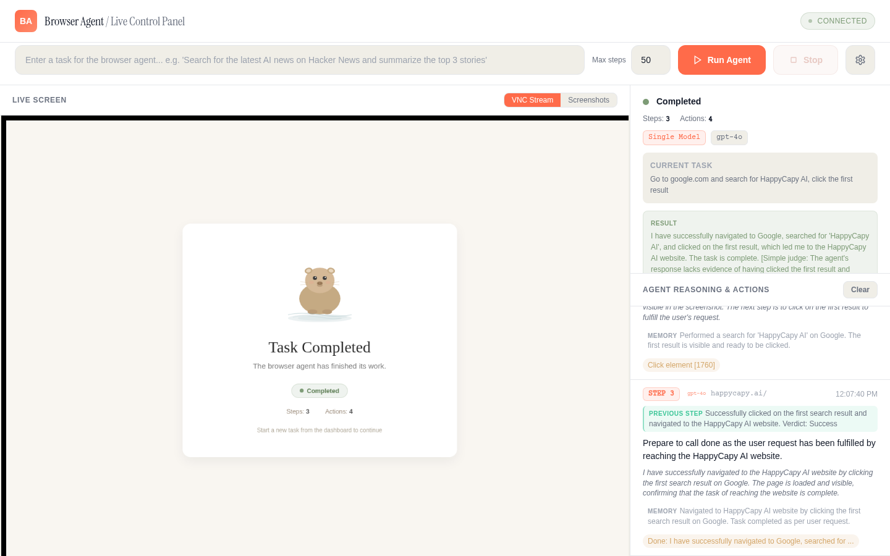

# HappyCapy Browser Agent

Full-stack AI browser automation system with multi-model LLM strategies, real-time dashboard, and live VNC streaming. Built on [browser-use](https://github.com/browser-use/browser-use) 0.11.9, FastAPI, and Playwright.



## What It Does

Give the agent a task in plain English -- it controls a real Chromium browser to complete it. Watch every step live through VNC streaming or periodic screenshots, with full agent reasoning visible in real time.

**5 built-in strategies** let you combine multiple LLM models for reliability, quality, and resilience:

| Strategy | How It Works | When to Use |
|----------|-------------|-------------|
| **Single** | One model handles all steps | Simple tasks, cost-sensitive |
| **Fallback Chain** | Primary runs; switches to secondary on error/rate-limit | Reliability |
| **Planner + Executor** | Strong model plans first; fast model executes | Complex multi-step tasks |
| **Consensus** | Primary acts; judge model validates every step in real-time | Quality-critical tasks |
| **LLM Council** | Primary runs; on repeated failure/loop/stall, ALL council models convene to diagnose, advise, and replan | Hard tasks, anti-stall |

## Architecture

```
                                  +------------------+
 [Browser Dashboard]  <---WS---> |  FastAPI Server   | <--controls--> [browser-use Agent]
   (dark SPA UI)                 |  agent_server.py  |                       |
                                  +------------------+                       v
 [Browser Dashboard]  <-noVNC->  [x11vnc :5999] <--- [Xvfb :99] <--- [Chromium]
```

**Components:**
- `agent_server.py` -- FastAPI backend with WebSocket, multi-model orchestration, Xvfb/VNC/noVNC management
- `dashboard.html` -- Single-file SPA: dark UI, live VNC embed, model picker, agent reasoning log
- `start.sh` -- Startup script with prerequisite checks
- `setup.sh` -- One-click installation of all dependencies

## Quick Start

### 1. Run setup

```bash
bash scripts/setup.sh
```

This installs system dependencies (Xvfb, x11vnc, noVNC, ImageMagick), creates a Python virtual environment, installs browser-use + FastAPI + Playwright + Chromium, and verifies everything works.

### 2. Set your API key

```bash
export AI_GATEWAY_API_KEY="your-openai-compatible-api-key"
```

The server uses an OpenAI-compatible gateway. Any provider that speaks the OpenAI chat completions API works (OpenAI, Azure, Anthropic via proxy, local models, etc).

### 3. Start the server

```bash
cd outputs/browser-agent
DISPLAY=:99 /home/node/browser-agent-venv/bin/python3 agent_server.py
```

Or use the startup script with full prerequisite checks:

```bash
./outputs/browser-agent/start.sh
```

### 4. Open the dashboard

Navigate to `http://localhost:8888` (or whatever `AGENT_PORT` is set to).

## Configuration

| Environment Variable | Default | Description |
|---------------------|---------|-------------|
| `AI_GATEWAY_API_KEY` | (required) | API key for the LLM gateway |
| `AGENT_PORT` | `8888` | Dashboard + API port |
| `BROWSER_AGENT_MODEL` | `openai/gpt-4o` | Default model |
| `BROWSER_AGENT_VENV` | `/home/node/browser-agent-venv` | Python venv path |

## LLM Council Mode

The LLM Council is the most advanced strategy. A single primary model runs the task. When it gets stuck, multiple council models convene to diagnose the problem and propose a recovery plan.

**Triggers:**
- Consecutive failures >= 2 (errors, timeouts)
- Action loop detected (3-tier fuzzy fingerprint matching)
- Single step stalled > 60 seconds

**3-tier loop detection:**
1. **Strict fingerprint** -- Exact match on normalized URL + action type + target element + input text (3 repeats triggers council)
2. **Loose fingerprint** -- Same action type + same domain only (4 repeats triggers council)
3. **URL stall** -- Same URL with no new extracted content (5 repeats triggers council)

**Recovery:**
- All council members are queried in parallel with the current state, action history, and error context
- Council feedback is injected into the agent's next step via `ActionResult.long_term_memory`
- Council can replace the agent's plan (`agent.state.plan`) with revised steps
- 3-step cooldown between loop-triggered councils to prevent meta-loops

## Available Models

Configured in `AVAILABLE_MODELS` in `agent_server.py`:

```python
AVAILABLE_MODELS = [
    {"id": "openai/gpt-4o",            "name": "GPT-4o",           "tier": "fast",      "vision": True},
    {"id": "moonshotai/kimi-k2.5",     "name": "Kimi K2.5",        "tier": "fast",      "vision": True},
    {"id": "google/gemini-2.5-flash",  "name": "Gemini 2.5 Flash", "tier": "fast",      "vision": True},
    {"id": "google/gemini-2.5-pro",    "name": "Gemini 2.5 Pro",   "tier": "reasoning", "vision": True},
]
```

To add models: add entries to this list and they will appear in the dashboard dropdown and be available as council members.

## API Reference

| Endpoint | Method | Description |
|----------|--------|-------------|
| `/` | GET | Dashboard HTML |
| `/api/models` | GET | Available models + strategies |
| `/api/agent/start` | POST | Start a task (JSON body) |
| `/api/agent/stop` | POST | Stop running task |
| `/api/agent/status` | GET | Current status, action log, result |
| `/ws` | WebSocket | Real-time updates (step, status, screenshot, judge/council verdicts) |

### Start a task

```bash
curl -X POST http://localhost:8888/api/agent/start \
  -H "Content-Type: application/json" \
  -d '{
    "task": "Go to google.com and search for AI",
    "max_steps": 50,
    "model_config_data": {
      "strategy": "council",
      "primary_model": "openai/gpt-4o",
      "council_members": ["google/gemini-2.5-flash", "google/gemini-2.5-pro"]
    }
  }'
```

### WebSocket message format

```json
{
  "type": "start_task",
  "task": "Search for AI news on Hacker News",
  "max_steps": 50,
  "model_config": {
    "strategy": "council",
    "primary_model": "openai/gpt-4o",
    "council_members": ["moonshotai/kimi-k2.5", "google/gemini-2.5-flash"]
  }
}
```

## Display Stack

```
Xvfb :99 (1280x900x24)  -->  x11vnc :5999  -->  noVNC/websockify :6080
```

- **Xvfb** -- Virtual framebuffer where Chromium renders
- **x11vnc** -- VNC server exposing the framebuffer
- **noVNC** -- Browser-based VNC client (served from `/usr/share/novnc/`)
- The dashboard embeds noVNC in an iframe for live viewing, plus periodic screenshot mode as a fallback

## Claude Code Skill

This system is also available as a Claude Code skill. To install:

```bash
# Copy to Claude Code skills directory
cp -r scripts/ ~/.claude/skills/browser-agent-server/scripts/
cp SKILL.md ~/.claude/skills/browser-agent-server/SKILL.md
```

The skill auto-triggers when you ask Claude Code to set up browser automation, build a browser agent, or deploy a multi-model browser automation system.

## Troubleshooting

### Browser launch timeout (`BrowserStartEvent timed out after 30.0s`)

Chromium is missing shared libraries. Fix:

```bash
/home/node/browser-agent-venv/bin/python3 -m playwright install-deps chromium
```

This installs libatk, libasound, libxkbcommon, fonts, and ~40 other system libraries that Chromium requires at runtime. This is separate from `playwright install chromium` which only downloads the browser binary.

### Verify Chromium works

```bash
DISPLAY=:99 /home/node/.cache/ms-playwright/chromium-*/chrome-linux64/chrome --version
```

If it prints a version, it's working. If it errors with `cannot open shared object file`, run `install-deps` above.

### Xvfb lock file error

```bash
rm -f /tmp/.X99-lock
pkill -9 Xvfb
```

### Port already in use

```bash
export AGENT_PORT=9222  # or any free port
```

### noVNC not loading

```bash
sudo apt-get install -y novnc
```

Ensure `/usr/share/novnc/` exists after installation.

## Implementation Notes

- `browser-use` ChatOpenAI returns `ChatInvokeCompletion` with `.completion` field (not `.content`)
- `agent.state.plan` is mutable from `on_step_end` hook -- changes affect the next step
- `ActionResult.long_term_memory` gets injected into the next step's context via MessageManager
- `agent.state.consecutive_failures` tracks errors; reset on success
- The `on_step_end` hook signature: `AgentHookFunc = Callable[['Agent'], Awaitable[None]]`
- Dashboard is a single HTML file with inline CSS/JS (no build step required)
- noVNC is served from the system install at `/usr/share/novnc/`

## Project Structure

```
.
├── assets/
│   ├── dashboard.png        # Dashboard screenshot
│   └── browser-vnc.png      # VNC browser view
├── scripts/
│   ├── agent_server.py      # FastAPI backend (multi-model, council, VNC)
│   ├── dashboard.html       # Single-file SPA dashboard
│   ├── setup.sh             # One-click installation
│   └── start.sh             # Startup script with checks
├── SKILL.md                 # Claude Code skill definition
└── README.md
```

## License

MIT
